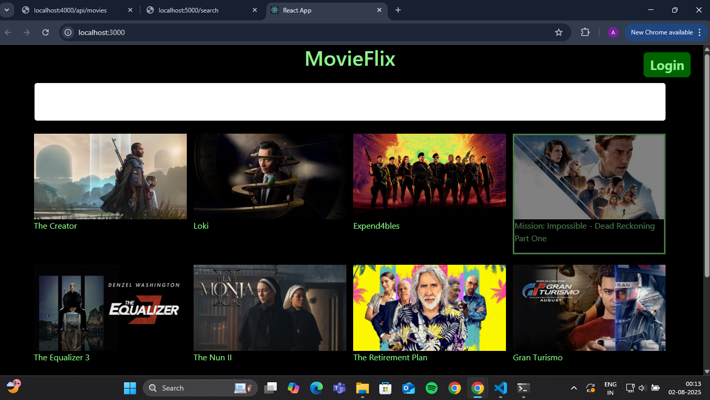

# 🎬 MovieFlix - Movie Search App

Welcome to **MovieFlix**! This project is a movie search and browsing app built with React and Express. You can browse a base set of movies, search for new ones, and enjoy a modern UI. 🚀


---

## 🛠️ Quick Start

### 1. 🚚 Clone the Repository

```bash
git clone https://github.com/4ritr0/MovieFlix.git
cd MovieFlix/new-react-app
```

### 2. 📦 Install Dependencies

```bash
npm install
```

### 3. ⚡ Start the Backend Servers

Open **two terminals** in the `new-react-app` directory:

#### Terminal 1: Home Page API

```bash
node src/HomePageAPI.js
# Runs at http://localhost:4000/api/movies
```

#### Terminal 2: Search API

```bash
node src/SearchAPI.js
# Runs at http://localhost:5000/search?query=your-movie
```

### 4. 💻 Start the React Frontend

In a third terminal (or after starting the servers above):

```bash
npm start
# App runs at http://localhost:3000
```

---

## 📝 Features

- 🔎 **Search** for movies using the search bar
- 🎞️ **Browse** a base set of 12 sample movies
- 🟢 **Login/Signup** modal (demo only)
- 🌙 **Modern UI** with Tailwind and Bootstrap

---

## 🐞 Troubleshooting

- If you see errors about missing dependencies, run `npm install` again.
- If you get a 500 error on search, make sure you:
  - Started both backend servers
  - Enter a non-empty search query
- If you see an icon error for `logo192.png`, you can ignore it or add a valid image to `public/`.

---

## 📂 Project Structure

```
new-react-app/
  ├── public/
  ├── src/
  │   ├── App.js
  │   ├── HomePageAPI.js
  │   ├── SearchAPI.js
  │   └── ...
  ├── package.json
  └── ...
```

---

## 🙌 Credits

- Built with [Create React App](https://github.com/facebook/create-react-app)
- Movie search powered by [flixhq-core](https://www.npmjs.com/package/flixhq-core)

---

Enjoy your movie search experience! 🍿
